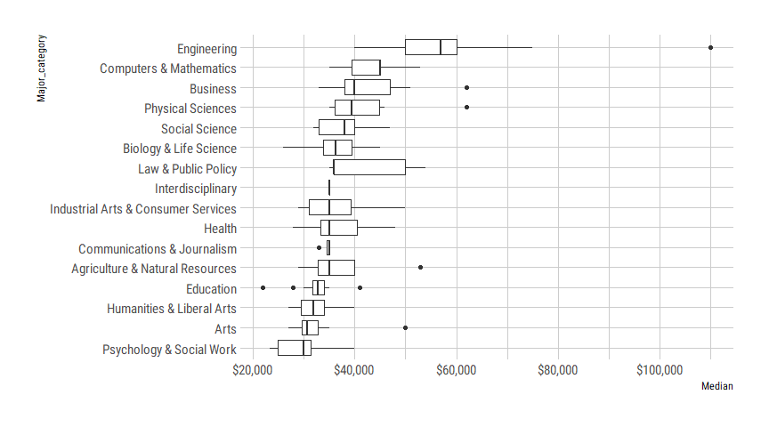
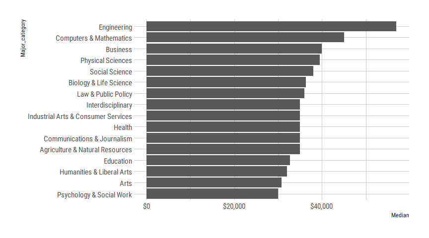
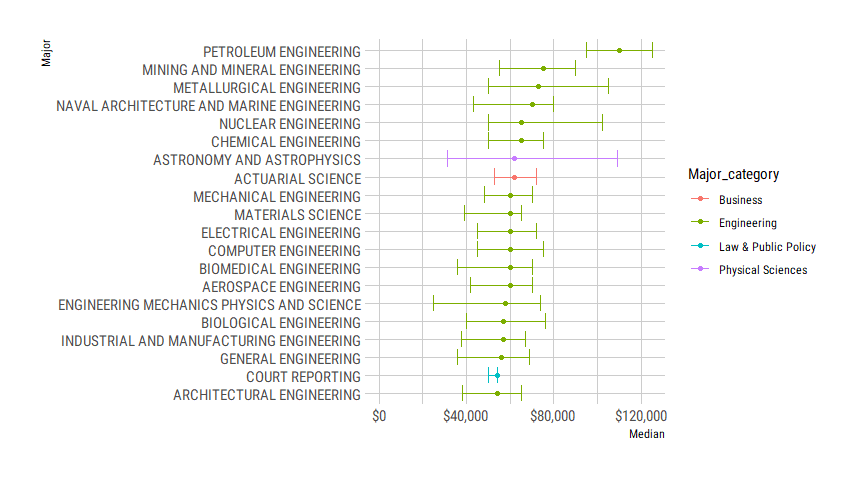

Economic Guide to College Major
================

# Economic Guide to College Major

<style type="text/css">
.sourceCode {
    font-family: Fira Code Retina;
}
.cover {
background-color: rgba(15, 15, 15, 1)
}

th {
background-color: rgba(0, 175, 214, 1)
}

.pagedtable-header-type {
color : rgba(214, 214, 214, 1)
}

h1, h2, h3 {
color: rgba(0, 175, 214, 1)
}

</style>

Loading the library:

``` r
library(tidyverse)
library(hrbrthemes)
library(scales)
```

Read the
file

``` r
recent_grads <- read_csv("https://raw.githubusercontent.com/rfordatascience/tidytuesday/master/data/2018/2018-10-16/recent-grads.csv")
```

    ## Parsed with column specification:
    ## cols(
    ##   .default = col_double(),
    ##   Major = col_character(),
    ##   Major_category = col_character()
    ## )

    ## See spec(...) for full column specifications.

``` r
recent_grads
```

    ## # A tibble: 173 x 21
    ##     Rank Major_code Major Total   Men Women Major_category ShareWomen
    ##    <dbl>      <dbl> <chr> <dbl> <dbl> <dbl> <chr>               <dbl>
    ##  1     1       2419 PETR~  2339  2057   282 Engineering         0.121
    ##  2     2       2416 MINI~   756   679    77 Engineering         0.102
    ##  3     3       2415 META~   856   725   131 Engineering         0.153
    ##  4     4       2417 NAVA~  1258  1123   135 Engineering         0.107
    ##  5     5       2405 CHEM~ 32260 21239 11021 Engineering         0.342
    ##  6     6       2418 NUCL~  2573  2200   373 Engineering         0.145
    ##  7     7       6202 ACTU~  3777  2110  1667 Business            0.441
    ##  8     8       5001 ASTR~  1792   832   960 Physical Scie~      0.536
    ##  9     9       2414 MECH~ 91227 80320 10907 Engineering         0.120
    ## 10    10       2408 ELEC~ 81527 65511 16016 Engineering         0.196
    ## # ... with 163 more rows, and 13 more variables: Sample_size <dbl>,
    ## #   Employed <dbl>, Full_time <dbl>, Part_time <dbl>,
    ## #   Full_time_year_round <dbl>, Unemployed <dbl>, Unemployment_rate <dbl>,
    ## #   Median <dbl>, P25th <dbl>, P75th <dbl>, College_jobs <dbl>,
    ## #   Non_college_jobs <dbl>, Low_wage_jobs <dbl>

## Which College Majors make more money than others?

Let’s explore the median salary

``` r
recent_grads %>%
  mutate(Major_category = fct_reorder(Major_category, Median)) %>%
  ggplot(aes(x = Major_category,y = Median)) +
  geom_boxplot() +
  coord_flip() +
  scale_y_continuous(labels = dollar_format()) +
  theme_ipsum_rc()
```

<!-- -->

Bar plot of the median:

``` r
recent_grads %>%
  group_by(Major_category) %>%
  summarize(Median = median(Median)) %>%
  mutate(Major_category = fct_reorder(Major_category, Median)) %>%
  ggplot(aes(x = Major_category,y = Median)) +
  geom_col() +
  coord_flip() +
  scale_y_continuous(labels = dollar_format()) +
  theme_ipsum_rc()
```

<!-- -->

### What are the highest earning Majors ?

``` r
recent_grads %>%
  arrange(desc(Median)) %>%
  select(Major, Major_category, Median, P25th, P75th) %>%
  head(20) %>%
  mutate(Major = fct_reorder(Major, Median)) %>%
  ggplot(aes(Major, Median, color = Major_category)) +
  geom_point() +
  geom_errorbar(aes(ymin = P25th, ymax = P75th)) + 
  expand_limits(y = 0) +
  scale_y_continuous(labels = dollar_format()) + 
  coord_flip() +
  theme_ipsum_rc()
```

<!-- -->
